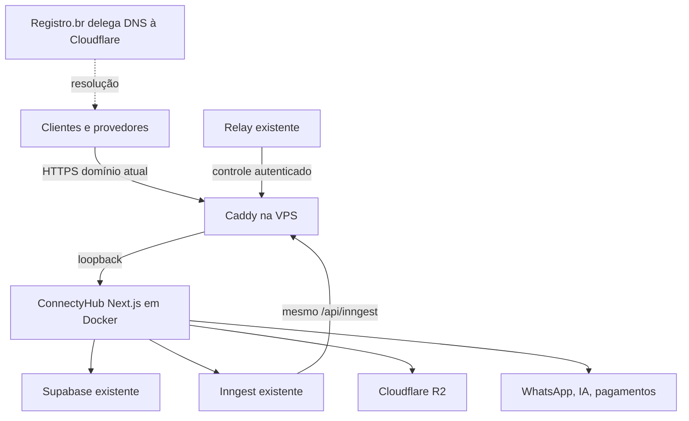

# Plano de migração da aplicação ConnectyHub: Vercel → VPS

Data: 28/09/2026. Inspeção ao vivo por SSH, DNS, HTTP e navegador entre aproximadamente 12h45 e 13h05 BRT. **Atualização: plano executado mediante autorização posterior do titular; aplicação na VPS e delegação DNS alterada. Pendências de propagação/aceite e cobrança constam abaixo e no estado operacional.**

O diagnóstico das seções seguintes retrata o estado anterior à execução. Resultado atual, revisão publicada, backup, testes e limitações: [estado-operacional.md](estado-operacional.md). Publicação futura: [deploy/README.md](../deploy/README.md).

## Recomendação

Hospedar a aplicação Next.js completa na VPS existente, em Docker, atrás do Caddy que já atende os serviços. Manter `https://www.connectyhub.com.br` como endereço público. Retirar também o DNS autoritativo da Vercel, preferencialmente para Cloudflare DNS Free, mantendo o domínio registrado no Registro.br. Começar com os registros em **DNS only**, com HTTPS público válido no Caddy.

Não é necessário manter a Vercel como proxy. Proxy HTTP e DNS são serviços diferentes: DNS informa o endereço do servidor; proxy recebe e encaminha cada requisição. Um projeto Vercel com rewrites continuaria dependente da conta, do tráfego e dos limites da Vercel. O plano Hobby é restrito a uso pessoal não comercial, incompatível com o uso comercial da ConnectyHub. [Regras oficiais](https://vercel.com/docs/limits/fair-use-guidelines), [rewrites](https://vercel.com/docs/routing/rewrites) e [uso do CDN](https://vercel.com/docs/manage-cdn-usage).

Cloudflare oferece DNS gratuito. O Registro.br também disponibiliza DNS e é uma alternativa caso a configuração da Cloudflare atrase. A preferência pela Cloudflare facilita a administração da zona e futuras integrações; não exige transferir o registro do domínio nem contratar hospedagem. [Cloudflare DNS](https://www.cloudflare.com/products/dns/), [Registro.br](https://www.registro.br/ajuda/tutoriais-administrativos/).

É plausível preparar e trocar a aplicação hoje, condicionado ao acesso ao ambiente Production, ao build Linux e à validação. A convergência mundial do DNS pode terminar depois da troca. Não prometer indisponibilidade zero nem cancelamento imediato de débitos vencidos.

## 1. Estado observado

| Componente | Evidência atual | Consequência para a migração |
|---|---|---|
| Código | `master`, remoto oficial `connectyhub02-sys/novaconnectyhub`; HEAD local, remoto e health público em `31b1284f406ba8946a3da0c7fb67faf10c61d2dd` | Fixar essa revisão como base funcional; reconferir antes de executar |
| Aplicação | Next.js **16.3.2**, React **19.2.4**, 234 arquivos de rota e 84 arquivos de página no código | Levar frontend e backend juntos; não é exportação de site estático |
| Produção HTTP | Health, login e documentação retornaram 200; `server: Vercel`; domínio sem www redireciona 307 para www | Preservar domínio, caminhos e comportamento de redirecionamento |
| Conta Vercel | Painel exibiu **Overdue**, falha de pagamento e aviso de encerramento; não mostrou prazo exato | Prioridade máxima para recuperar configuração e tirar tráfego |
| DNS | NS `ns1.vercel-dns.com` e `ns2.vercel-dns.com`; apex e www ainda resolvem para Vercel | Sair da hospedagem não retira automaticamente o DNS |
| VPS | `connectyhub-vps`, `13.140.34.227`, host `vmi3571281`; SSH funcional | Acesso de operação disponível |
| Capacidade | 8 CPUs; 23 GiB RAM, cerca de 7,1 GiB usados e 16 GiB disponíveis; disco 290 GB, 152 GB usados e 138 GB livres; sem swap | Há espaço aparente para o app; a amostra não é teste de carga |
| Concorrência no servidor | Supabase, Inngest, relay, portal e serviços Betel, Vision e Immov ativos; load médio de 6,22/4,94/4,76 na primeira amostra | Limitar build e aplicação; não tratar a VPS como exclusiva |
| HTTPS | Caddy em Docker com rede host; config `/opt/connectyhub/proxy/Caddyfile` | Adicionar dois hosts ao proxy existente; preservar todos os outros blocos |
| Supabase | Containers em execução, healthchecks saudáveis onde configurados; API em `supabase.connectyhub.com.br`, apontando para a VPS | Banco, Auth e Storage permanecem; não copiar dados novamente |
| Inngest | GET assinado do handler de produção: 200, autenticação válida, **51 funções**; API/eventos em `inngest.connectyhub.com.br` | Esse é o inventário atual para comparação, substituindo contagens históricas |
| Inngest compartilhado | Banco confirma 51 funções do app ativo ConnectyHub e 12 da Betel | Não parar o servidor inteiro nem registrar outra cópia das agendas |
| Execuções Inngest | Janela de 30 minutos: 305 Completed ConnectyHub; 73 Failed atribuídos à Betel | Falhas já existentes não são regressão desta migração; Completed não prova resultado de negócio |
| Registro Inngest | `--sdk-url https://www.connectyhub.com.br/api/inngest`, polling 300 s; URLs de steps do app usam domínio próprio | Manter URL, app ID, IDs de funções e chaves; conferir ressincronização |
| Relay IA/Estúdio | Container `connectyhub-ai-relay-relay-1` saudável, porta local 3120; controle em `https://www.connectyhub.com.br/api/internal/ai/relay` | Relay permanece; seu controle passa a ser atendido pelo novo app |
| Backup | Timer ativo; serviço com `Result=success`, código 0; arquivo de 28/09 às 06:33 UTC, cerca de 1,5 GB | Gerar captura antes da troca e verificar cópia externa; restauração atual não foi ensaiada |

As consultas ao Auth e ao health público do Inngest sem credencial retornaram 401, compatível com proteção de acesso; não foram tratadas como indisponibilidade. Não foram realizados login funcional, envio de mensagem, pagamento, geração de IA nem teste de carga nesta auditoria.

### Acessos e lacunas

- Titular confirmou acesso ao **Registro.br** nesta conversa; sessão e autorização sobre a zona ainda precisam ser conferidas na execução.
- CLI Vercel está na conta/equipe `immovai`, sem acesso à ConnectyHub. Não remover `.vercel`, não vincular outro projeto e não publicar em outra equipe para contornar isso.
- A aba do perfil Chrome `connectyhub02` exibiu o projeto correto e o aviso de cobrança, mas redirecionou ao login ao abrir Environment Variables. Nova autenticação foi solicitada ao titular.
- **Ambiente Production completo ainda não exportado.** O `.env.local` não contém, entre outros, `INNGEST_BASE_URL`, `INNGEST_DEV`, `AI_RELAY_SECRET`, `AI_RELAY_PUBLIC_URL`, `TRACKING_PUBLIC_TOKEN_SECRET`, `ASAAS_PLATFORM_API_KEY` e flags de Estúdio. Parte da configuração também vive no cofre criptografado do banco. Ausência local não comprova ausência em produção.
- Zona DNS completa, aliases adicionais, integrações/Storage gerenciados pela Vercel e configurações de firewall/crons no painel ainda não foram inventariados. Não há dependência direta `@vercel/*` em `package.json`, nem `vercel.json` ou pipeline `.github` encontrados no checkout; isso não prova inexistência de recursos configurados no painel.
- Auto Backup da Contabo e recuperação da cópia externa atual ainda não foram verificados nesta rodada.

## 2. O que muda de lugar

| Migrar da Vercel | Manter onde está |
|---|---|
| Páginas públicas, lojas, checkout e painéis cliente/admin | PostgreSQL, Auth, RLS e Supabase Storage na VPS |
| Todas as rotas `/api/*`, inclusive APIs WhatsApp e IA | Inngest, seus bancos, filas e histórico na VPS |
| Recepção de webhooks de UAZAPI, Meta e pagamentos | Relay WebSocket, uploads e assets privados do Estúdio na VPS |
| Handler `/api/inngest` e execução das funções | Mídias e objetos existentes no Cloudflare R2 |
| Proxy de sessão do Next, callbacks, tracking, arquivos estáticos e otimização de imagens | Provedores UAZAPI, Google/Gemini, ElevenLabs, Asaas, PagBank, Mercado Pago, Resend e outros ativos |
| Ambiente Production, publicação, health, logs e recuperação de release | Domínio registrado no Registro.br; apenas a delegação DNS muda |
| DNS e redirecionamento apex → www | Outros projetos/containers da VPS |

Não criar migrations de banco para esta troca de hospedagem. Clientes continuam com os mesmos dados, credenciais de acesso, carteiras e endereços. A preservação de sessões deve ser testada, não prometida.

## 3. Arquitetura de destino

Começar com **uma instância ativa** da aplicação. Preparar dois slots locais para releases: por exemplo `127.0.0.1:3130` e `127.0.0.1:3131`, livres na inspeção, a reconferir. Caddy aponta para um slot por vez; o outro permite preparar e retornar uma versão sem reconstruir durante o incidente.

Sugestão inicial de orçamento do app: até 2 CPUs e 4 GiB, sujeito a ajuste com medição. Build isolado, sem concorrência com outro build pesado, inicialmente limitado a até 3 CPUs/6 GiB. São limites propostos, não capacidade comprovada. Acompanhar CPU, RAM disponível, OOM, latência e filas; abortar preparação se prejudicar os serviços existentes.

## 4. Preparação técnica necessária

### Empacotamento e publicação

1. Criar checkout/release isolado a partir do SHA confirmado. Preservar alterações locais e arquivos não rastreados existentes; não enviar o diretório de trabalho inteiro à VPS.
2. Acrescentar `output: "standalone"` ao `next.config.ts`, preservando `outputFileTracingIncludes` das migrations, redirects e imagens. Alternativa de contingência: imagem com dependências e `next start`, também suportado, se o standalone apresentar problema de trace.
3. Criar Dockerfile para build Linux com Node 24, confirmado nas configurações reais da produção e fixado por digest. Usar `npm ci`; na execução foi necessário sincronizar os registros opcionais do lockfile para Linux, sem trocar as versões das dependências existentes. Não atualizar Next/React/dependências na migração.
4. Incluir no runtime `.next/standalone`, `.next/static`, `public` e o catálogo `supabase/migrations` no caminho esperado por `src/lib/infrastructure/server.ts`. Verificar `sharp`/otimização de imagens no Linux. Não transportar `node_modules` ou `.next` compilados no Windows.
5. Criar `.dockerignore` que exclua `.env*`, Git, backups, logs, temporários e dados privados. Fornecer variáveis públicas no build; segredos por montagem temporária de build, se necessários, e ambiente privado em runtime, nunca por `ARG` gravado na imagem.
6. Criar Compose próprio em `/opt/connectyhub/app`, sem reutilizar nomes/projeto Compose do banco. Imagem identificada pelo SHA, usuário sem privilégios, porta somente loopback, `restart: unless-stopped`, healthcheck e rotação de logs. Nenhuma montagem do socket Docker.
7. Preservar permissão de escrita para cache do Next. Manter assets de releases anteriores durante a transição para não quebrar abas já abertas; avaliar `deploymentId` e chave de Server Actions caso se use mais de um build simultaneamente.
8. Adicionar publicação reproduzível: build → candidato → verificações → troca de upstream → retenção da imagem anterior. Para hoje, script manual controlado é suficiente; automação GitHub pode vir depois. Push em `master` deixará de ser prova de deploy da VPS.

### Ambiente e compatibilidade

| Grupo | Tratamento |
|---|---|
| Origem pública | `NEXT_PUBLIC_APP_URL=https://www.connectyhub.com.br`; alinhar `APP_URL` e outras origens efetivamente usadas |
| Supabase | Preservar URL pública da VPS, chave pública e chave de serviço. Não substituir URL pública por IP/container: o navegador também a usa |
| Cofre | Preservar **exatamente** `CREDENTIAL_ENCRYPTION_KEY`; regenerá-la impede abrir credenciais já cifradas |
| Inngest | Preservar event/signing keys, `INNGEST_BASE_URL=https://inngest.connectyhub.com.br`, `INNGEST_DEV=0` e eventuais overrides existentes |
| Sessões, links e push | Preservar segredos de tracking, webhooks, VAPID e autenticação interna, inclusive os armazenados no cofre |
| IA, pagamentos, R2 e integrações | Exportar configuração real e flags de produção; confrontar com código e cofre. Não preencher automaticamente com exemplos |
| Relay/Estúdio | Preservar URLs, segredo compartilhado e flags; conferir autenticação entre relay existente e novo app |
| Versão | Health e coletor ainda leem `VERCEL_GIT_COMMIT_SHA`. Na transição, fornecer o SHA nesse nome como metadado, ou adaptar ambos para `CONNECTYHUB_BUILD_SHA` com fallback; não deixar health sem versão |
| Variáveis públicas | São incorporadas no build pelo Next. Corrigir apenas o ambiente do container não corrige um bundle compilado com valores errados |

Comparar chaves e valores do ambiente transferido em processo privado, emitindo somente presença/igualdade. Exportação protegida fora do Git, com acesso restrito; não imprimir tokens em logs ou chat. A aplicação usa credenciais do banco além de variáveis de ambiente.

As referências a `VERCEL_URL` e `VERCEL_PROJECT_PRODUCTION_URL` são principalmente fallbacks para formar URLs. Com origem pública explícita, não exigem manter hospedagem Vercel. Auditar URLs persistidas e configurações de provedores para referências diretas `*.vercel.app`, que não poderão ser levadas para outro host.

`after()` é usado no webhook UAZAPI e na contabilização de streams IA. É suportado no servidor Next próprio. Executar Node diretamente e drenar requisições/callbacks antes de encerrar o container; dimensionar o prazo de desligamento para operações atuais de até 300 s, testando esse comportamento. O `maxDuration` de rota não configura sozinho os limites do Docker/Caddy.

### Proxy, TLS e segurança de borda

- Preservar `Host`, `X-Forwarded-Proto` e IP real, confiando somente no proxy controlado; o código usa IP para guardas. Não aceitar cabeçalhos forjados como origem confiável.
- Preservar SSE, respostas em streaming, WebSockets e parâmetros dos webhooks. Definir timeouts compatíveis com as rotas atuais, sem buffer que atrase streams.
- Manter limites de upload por caminho conforme o contrato existente. Não aplicar indiscriminadamente o limite de 2 MB da Betel ou o de 20 MB do relay a todas as APIs.
- Não colocar cache compartilhado em páginas autenticadas, respostas de API, checkout ou callbacks. Respeitar headers de cache do Next e testar arquivos estáticos/imagens.
- Conferir quais proteções Vercel estão efetivamente em uso e reproduzir as necessárias no destino. DNS only não fornece WAF/CDN/proteção de proxy Cloudflare.
- Validar a configuração inteira do Caddy antes do reload, sem remover blocos de Supabase, Inngest, Betel, portal ou relay.
- Providenciar certificado público válido para apex e www **antes** de direcionar usuários. Preferir validação DNS-01 no DNS ainda autoritativo, por mecanismo suportado já disponível ou provisionado; conferir CAA, renovação e persistência. Não assumir que o Caddy atual possui plugin DNS nem que certificado Cloudflare Origin seja válido para acesso direto.
- Se pré-emissão não for viável, planejar explicitamente a emissão HTTP-01/TLS-ALPN após troca como janela de risco; não prometer HTTPS sem interrupção. Testar com `curl --resolve` e validação normal de certificado, nunca `-k` como critério de aceite.

## 5. Ordem de execução hoje

| Etapa | Ação | Critério para avançar | Estimativa de trabalho |
|---|---|---|---|
| 1. Resgatar configuração | Autenticar equipe correta; exportar Production, zona DNS completa, aliases, configurações de build/runtime, integrações, crons e firewall; confirmar SHA | Configuração recuperável e sem lacunas críticas | 30–60 min |
| 2. Preparar destino | Backup/cópia externa; imagem e Compose; slots locais; health/logs; TLS; zona nova preparada | Build Linux e boot passam sem afetar os outros serviços | 60–120 min |
| 3. Homologar candidato | Testar por domínio real resolvido para a VPS, preservando origem e TLS | Matriz abaixo aprovada; ambiente e arquivos do build conferidos | 30–60 min |
| 4. Tirar tráfego | Trocar registros apex/www no DNS atual para VPS; registrar horário; acompanhar acessos, filas e registro Inngest | Produção responde pela VPS, com SHA esperado e fluxos essenciais funcionando | 15–30 min + caches DNS |
| 5. Sair do DNS Vercel | Conferir zona nova completa com mesmos destinos; alterar NS no Registro.br; tratar DNSSEC/DS corretamente | Novos NS autoritativos corretos e resolvedores convergindo, sem perda de e-mail/subdomínios | 15–30 min + propagação |
| 6. Encerrar dependência | Validar nova publicação/rollback; observar 30–60 min inicialmente; revisar assinatura e outros projetos | Tráfego e configuração independentes; cobrança tratada separadamente | 30–60 min iniciais |

Estimativa global: aproximadamente **3–6 horas de trabalho**, podendo aumentar por autenticação, build, certificado ou recuperação de configuração. Propagação de DNS/delegação não obedece a esse orçamento.

O DNS novo pode ser preparado durante o build. Para minimizar risco, alterar primeiro apenas apex/www nos NS atuais, validar a VPS e depois trocar a delegação; durante a propagação, os dois provedores devem responder os mesmos destinos. Se a Vercel bloquear acesso antes disso, usar a zona nova e o Registro.br como contingência, após reconstruir o inventário necessário, aceitando que caches antigos continuarão dependendo da origem até expirar.

Reduzir TTL de apex/www quando o acesso permitir e respeitar o TTL anterior. A consulta observou TTL de 1.800 s no apex e 14.400 s nos NS; o TTL da delegação no pai e caches adicionais precisam ser conferidos. Reduzir TTL de A agora não acelera retroativamente caches nem NS já armazenados.

### DNS: preservar mais que o site

Inventariar todos os registros A/AAAA/CNAME/MX/TXT/CAA/SRV, wildcards e delegações. A lista conhecida abaixo é um mínimo, não exportação completa:

- `@` e `www`: novo app na VPS, substituindo os destinos Vercel.
- `supabase`, `inngest`, `ai-relay`, `infraestrutura`, `betel`, `betel-supabase`: preservar destinos atuais verificados individualmente.
- Resend: DKIM, SPF/MX de `send` e DMARC descritos na migração anterior; preservar também demais provedores de e-mail/verificações realmente presentes.
- Conferir registros AAAA conflitantes: clientes IPv6 não podem continuar alcançando a hospedagem antiga. Não criar AAAA sem validar IPv6 na VPS.
- Auditar DNSSEC no Registro.br e no provedor; uma delegação nova com DS antigo incompatível pode tornar o domínio inteiro irresolvível. Planejar a transição e reativação conforme os provedores.

Não confiar somente na varredura automática da Cloudflare: ela pode omitir registros. [Procedimento oficial de migração](https://developers.cloudflare.com/dns/zone-setups/full-setup/setup/).

### Inngest e requisições em trânsito

Manter o mesmo app `connectyhub`, IDs, chaves, filas e banco. Durante a homologação, não executar `PUT /api/inngest` nem registrar o candidato como outro app de produção. GET assinado é leitura e serve para comparar autenticação, origens e as 51 funções atuais.

Como ambas as hospedagens podem atender requisições durante o cache DNS, usar a mesma revisão funcional e os mesmos mecanismos de idempotência/claims. Não criar cron do sistema duplicando crons Inngest. Não reiniciar nem parar o Inngest compartilhado para efetuar esta troca.

Após a virada, conferir que o servidor Inngest resolve o domínio para a VPS e que os handlers chegaram ao novo container. Ressincronizar o **mesmo** app se necessário e comparar funções/gatilhos. Não arquivar/recriar o app: isso pode afetar execuções pendentes. Aguardar jobs em curso e verificar reservas, recibos e mensagens antes de desligar a origem; não reenviar em massa eventos sem prova de necessidade.

## 6. Matriz mínima de aceite

| Percurso | Evidência exigida |
|---|---|
| Aplicação e domínio | Health 200 com SHA, login/docs/site/loja carregando; apex → www preserva caminho/query; TLS válido em ambos |
| Assets e Next | JS/CSS e imagens servidos pela VPS; sem referência indevida a localhost; catálogo SQL presente no container |
| Autenticação | Sessão existente, login de admin e de cliente comum, isolamento de organizações; callback Google se utilizado |
| APIs protegidas | Sem sessão/chave retorna recusa esperada; credencial válida acessa somente o escopo permitido |
| WhatsApp | Webhook recebido, execução/entrega única e histórico persistido; usar conta/número de teste combinado, não cliente aleatório |
| Automações | 51 funções e gatilhos equivalentes; execução natural observada; atrasos, retries e falhas separados por app |
| IA e créditos | Autorização/cotação/recibo; stream e fechamento/liquidação sem duplicação; teste pago somente com orçamento combinado |
| Pagamentos | Checkout, callback e consulta de status; assinaturas e idempotência preservadas; não gerar cobrança real para testar hospedagem |
| Relay/Estúdio | Health e controle autenticado; acesso privado a asset/ticket; WebSocket e liquidação quando houver sessão controlada |
| Storage | Leitura pública esperada e arquivo privado protegido; R2/Supabase continuam nos destinos atuais |
| Operação | Novo container reinicia e passa health; rotação de logs, recursos, backups, publicação e retorno testados |
| DNS/e-mail | Zona completa nos novos NS; consultas de múltiplos resolvedores; SPF/DKIM/DMARC/MX preservados; demais subdomínios acessíveis |

Falha de acesso, chave de criptografia, assinatura webhook, isolamento, duplicação financeira, erros 5xx persistentes ou prejuízo aos serviços existentes bloqueiam a troca. Liveness 200 sozinho não aprova a migração. Manter incidentes preexistentes, como os Failed da Betel, separados da comparação antes/depois.

## 7. Rollback e contingência de corte da Vercel

**Retorno principal na própria VPS:** manter a imagem funcional anterior, configuração de ambiente e slot preparados; trocar upstream do Caddy, validar e recarregar. Drenar o container retirado antes de encerrá-lo. Para a primeira migração, preparar uma imagem conservadora da revisão atual, sem mudanças de negócio, e conservar o candidato que passou na homologação.

**Retorno temporário à Vercel:** só existe se a conta/deploy ainda estiver operacional. Restaurar os registros exatos exportados, nunca IPs genéricos copiados de tutorial. DNS pode demorar para convergir. Não usar essa possibilidade como única recuperação, pois a conta está vencida.

Banco e filas permanecem na VPS em ambos os casos. Não restaurar dump antigo para desfazer uma troca de app: isso perderia operações legítimas feitas depois. Não executar migrations, renovar segredos ou reativar serviços Cloud durante o rollback.

Se a Vercel suspender antes de a VPS estar pronta, priorizar resgate do ambiente, build da revisão atual e ativação do novo DNS pelo Registro.br. Estabelecer um único destino válido para webhooks e registrar a janela sem recepção. Inventariar eventos/recibos pendentes e políticas de retry dos provedores; não afirmar que todos reenviarão automaticamente nem gerar mensagens/cobranças duplicadas na recuperação.

Se o ambiente Production ficar inacessível, cruzar backups privados, configurações dos serviços e cofre com a lista de dependências. A cópia local isolada **não** basta. Segredo indispensável irrecuperável bloqueia o fluxo correspondente; documentar a lacuna antes de anunciar serviço integral.

## 8. Publicação futura, custos e conclusão

O caminho futuro deve ser GitHub → build Linux → imagem por SHA → homologação local → Caddy. Implementar rollback, logs e observação externa, pois o cockpit hospedado no próprio app não alerta se o app inteiro cair. Atualizar o coletor/cadastro de infraestrutura para informar hospedagem VPS, versão, imagem e possibilidade real de retorno.

Com a aplicação e o DNS fora da Vercel, o objetivo é eliminar o custo futuro de hospedagem Vercel. Continuam VPS, backup, renovação do domínio, R2, IA, WhatsApp, pagamentos e e-mail conforme os contratos existentes. Não foi auditada a fatura nem calculada uma economia mensal exata. Sair da plataforma não apaga valores vencidos.

Antes de downgrade/cancelamento, conferir todos os projetos da equipe, integrações de Marketplace, domínios e políticas de retenção. Parar a publicação automática na Vercel apenas quando o publicador VPS estiver comprovado; preservar o material necessário para recuperação. Não cancelar a equipe inteira presumindo que há somente este projeto.

Após concluir a execução, atualizar `docs/contexto-projeto.md` e `docs/estado-operacional.md`: nova arquitetura, comando/fluxo de publicação, SHA/imagem, caminhos operacionais, DNS, backup, evidências de aceite e pendências. Os documentos atuais descrevem a publicação Vercel e só devem passar a afirmar migração concluída depois da validação real.

## 9. Registro do planejamento inicial (superado pela execução)

Recuperar a sessão da **equipe correta da Vercel** e exportar Production + zona DNS completa. Em seguida preparar o pacote Docker e a zona nova, validar o candidato e executar a troca conforme os critérios acima. O SSH já está disponível e o titular confirmou acesso ao Registro.br.

Na rodada inicial foram realizadas somente inspeções e documentação. Posteriormente o titular autorizou a execução, concluída tecnicamente conforme o registro operacional, com pendências explicitadas. O runtime escolhido foi Node 24, conforme o projeto real da Vercel; a nova zona tem 16 registros. A hospedagem não usa proxy Vercel. O downgrade tentado ainda não foi efetivado na conta vencida.

## Fontes técnicas

- Repositório: `package.json`, `next.config.ts`, `src/proxy.ts`, `src/lib/supabase/proxy.ts`, `src/app/api/health/route.ts`, `src/app/api/inngest/route.ts`, `src/lib/inngest/functions.ts`, `src/lib/ai-api/streaming.ts`, `src/app/api/webhooks/uazapi/route.ts`, `src/lib/infrastructure/server.ts`, `services/ai-relay/README.md`.
- Guia instalado da versão usada: `node_modules/next/dist/docs/01-app/02-guides/self-hosting.md` e `node_modules/next/dist/docs/01-app/03-api-reference/05-config/01-next-config-js/output.md`. Fundamentam standalone, assets, variáveis públicas, streaming e desligamento com `after()`.
- Contexto e histórico: `docs/contexto-projeto.md`, `docs/estado-operacional.md`, relatórios de migração Supabase/Inngest de 11/09 e infraestrutura de 16/09; números históricos não foram reutilizados como capacidade atual.
- Evidência atual: HTTP público e GET Inngest assinado; consultas PostgreSQL somente leitura ao registro/contagens; `docker ps/stats/inspect`, `free`, `df`, `vmstat`, `ss`, systemd; DNS público e painel Vercel. Segredos e conteúdos de clientes foram omitidos.

## Encerramento da cobrança: pendência verificada

O projeto não está mais conectado ao Git da Vercel. A equipe contém apenas `novaconnectyhub`. O painel permitiu enviar a solicitação de downgrade, porém não confirmou a mudança; após duas tentativas e nova consulta, a API continuou indicando Pro, overdue e nenhum cancelamento agendado. Não foi efetuado pagamento. Tratar o encerramento com a Vercel; não presumir que a migração cancela a assinatura ou elimina a fatura vencida. [Cobrança da equipe](https://vercel.com/nova-connectyhub-s-projects/~/settings/billing), [suporte](https://vercel.com/help), [regras oficiais de cobrança](https://vercel.com/docs/plans/pro-plan/billing).

Texto preparado para o titular, **não enviado**: “Migrei a aplicação e o DNS para fora da Vercel e desconectei a publicação Git. Solicito o encerramento do plano Pro e confirmação de que não haverá nova renovação. O fluxo de downgrade não efetivou a alteração, e a equipe Nova Connectyhub's projects continua com status overdue. Favor confirmar o cancelamento e detalhar separadamente qualquer valor pendente.”
