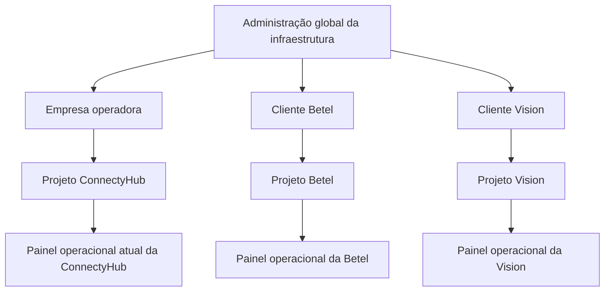
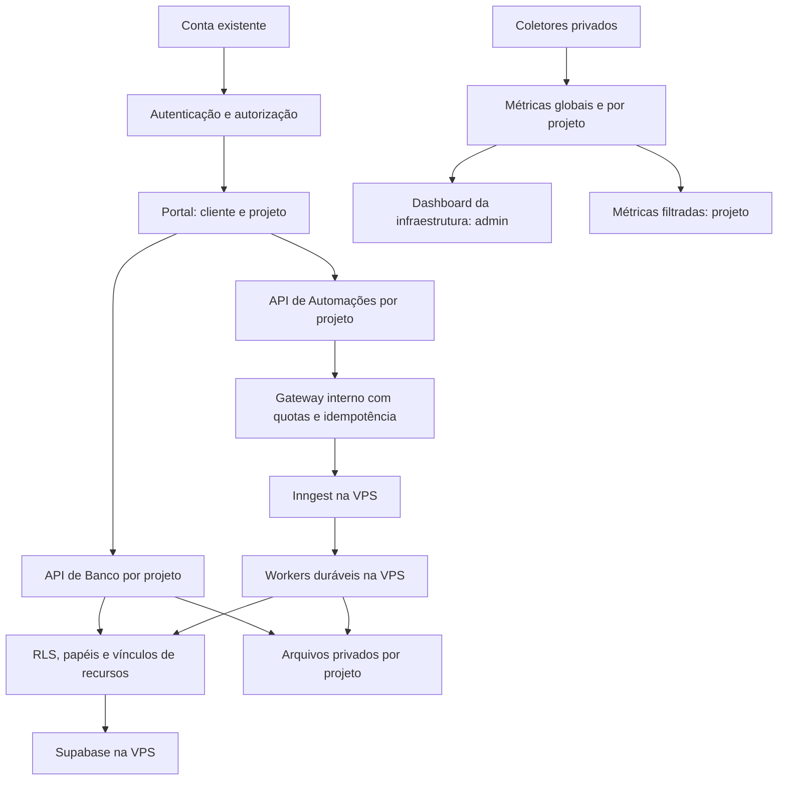

# Portal de projetos gerenciados — plano e estado do piloto

Data: 15/09/2026. Branch local: `codex/managed-projects`, base `9d864e13`.

**Atualização após autorização de execução:** o piloto local já foi implementado. O escopo completo abaixo continua como roteiro; não representa paridade Cloud entregue. Estado, evidências e procedimentos estão no [relatório do piloto](piloto-projetos-gerenciados-2026-09-15.md). Nenhum componente deste piloto foi publicado ou aplicado à produção.

## Resultado pretendido

Uma entrada na ConnectyHub, com o login existente, para administrar clientes e seus projetos. Cada projeto terá duas áreas reconhecíveis: **Banco**, seguindo a navegação do Supabase Cloud, e **Automações**, seguindo a navegação do Inngest Cloud. O administrador escolhe cliente e projeto; o cliente vê somente os projetos aos quais tem acesso. A saúde da VPS fica em uma área exclusiva da administração.

A intenção é preservar a aparência e os fluxos familiares das versões Cloud, com recursos reais. Isso não torna as APIs comerciais desses produtos disponíveis na instalação própria. O reaproveitamento de componentes será decidido por arquivo, licença e compatibilidade, sem expor um console global dentro de um iframe. A identidade apresentada será ConnectyHub, preservando os avisos exigidos pelo código reutilizado.

Primeiro construir e validar a plataforma. **A migração da Betel é a última fase**, preservando sua identidade, carteira, voz, arquivos e histórico. Não criar uma nova instalação Supabase/Inngest automaticamente a cada cadastro.

### Hierarquia confirmada na revisão

O nível superior é a **administração global da infraestrutura**. Abaixo dele ficam as empresas/clientes e seus projetos. As três referências iniciais são:

| Empresa / cliente | Projeto gerenciado de referência | Painel operacional |
|---|---|---|
| Empresa operadora da ConnectyHub | ConnectyHub | Mantém o painel atual de atendimento, agentes, vendas e APIs. |
| Cliente Betel | Betel | Mantém sua identidade e operação; entrada futura após validação e plano de migração. |
| Cliente Vision | Vision | Mantém sua identidade e operação; entrada futura depende de diagnóstico e plano próprios. |

Esses nomes representam a hierarquia pretendida, não cadastros ou migrações já realizados. Uma empresa pode ter vários projetos; um projeto pertence a uma empresa. Organização pagadora continua um vínculo financeiro separado.

**Administrador do produto ConnectyHub não recebe automaticamente privilégios globais de infraestrutura.** A autenticação pode ser a mesma, mas o acesso global exige concessão explícita e auditável de uma capacidade própria, por exemplo `infrastructure_admin`. O campo existente `is_platform_admin`, isoladamente, não será suficiente para essa concessão. Administradores de empresa e de projeto permanecem limitados aos seus escopos. O mesmo usuário pode acumular papéis quando isso for expressamente configurado.

O seletor superior abre Banco e Automações do projeto escolhido. O projeto ConnectyHub participa dessa mesma hierarquia e conserva seu painel de produto; sua inclusão no catálogo não transfere nem recria dados. Nesta revisão não haverá alteração de contas, concessão de papéis ou migração da Betel/Vision.

## O que já foi feito e o que ainda não existe

| Item | Evidência / estado |
|---|---|
| Ambiente de trabalho isolado | Worktree criado; checkout principal preservado. |
| Arquitetura atual | Contexto operacional e autenticação, organizações, projetos de voz, carteira e operações do Estúdio examinados. |
| Recursos da VPS | Leitura administrativa nesta tarefa: 8 vCPU, 25,20 GB de RAM total, 22,37 GB disponíveis; disco de 310,91 GB com aproximadamente 10% usado. Uma amostra, não teste de capacidade. |
| Serviços instalados | Inngest `v1.44.0`, Supabase PostgreSQL `17.6.1.136`, Studio `2026.09.07-sha-7996410`; serviços com healthcheck estavam saudáveis na consulta. |
| Limites operacionais | Inngest com limite de 4 GiB; vários contêineres Supabase ainda compartilham o limite do host. Precisamos de séries históricas e limites adequados antes de admitir novos projetos. |
| Licenças | Licença do servidor Inngest na versão instalada e licença do repositório Supabase no commit do Studio consultadas. Inventário de todos os componentes ainda pendente. |
| Referência visual Cloud | Preferência registrada. O mapa abaixo é preliminar; ainda não houve inventário visual autenticado completo das contas Cloud nesta etapa. Não há comparação pixel a pixel concluída. |
| Nova plataforma | Piloto implementado: migration 0150 ensaiada localmente, endpoints com autorização/RLS, portal, arquivos pequenos privados, fila diagnóstica, worker e gateway interno. Integrações reais e implantação continuam pendentes. |
| Produção | Nenhuma migration, implantação, reinício, cliente novo ou migração da Betel executados por este plano. |

Os testes financeiros e publicações anteriores pertencem a outro pacote; não validam este portal. O pacote `17731ed` já está incluído na produção `e597e610`, cuja implantação foi novamente conferida como Ready. Ele não contém esta plataforma.

## Telas e rotas propostas

Decisão da implementação: entrada independente em `/infraestrutura`, projetos em `/infraestrutura/projetos/[projectId]` e host em `/infraestrutura/vps`. Isso evita acoplar a autorização de infraestrutura aos layouts existentes de administração do produto. O login existente é reutilizado no adaptador de produção; somente o piloto separado usa identidades fictícias. O mapa abaixo preserva os prefixos originalmente propostos como referência histórica, substituídos por `/infraestrutura` no piloto. O painel operacional atual conserva suas rotas e permissões.

| Referência Cloud | Tela ConnectyHub | Backend disponível / adaptação necessária |
|---|---|---|
| Organização e seletor de projetos | `/admin/projetos`: cliente → projetos; `/dashboard/projetos`: projetos permitidos | Reutilizar organizações e contas. Criar catálogo de projetos gerenciados, vínculos e permissões explícitas. |
| Supabase Project Overview | `.../banco` | Resumo real do projeto, uso, estado dos serviços associados e atalhos; agregações por projeto novas. |
| Supabase Table Editor | `.../banco/tabelas` | Reaproveitar padrões de grade, filtros, paginação e detalhes. Acesso somente a tabelas/esquemas autorizados; não oferecer o administrador global do PostgreSQL. |
| Supabase SQL Editor | `.../banco/sql` | Inicialmente operador da plataforma. SQL de cliente somente com papel de banco e limite de recursos comprovadamente restritos; filtrar SQL por palavras não é isolamento. |
| Supabase Authentication | `.../banco/auth` | Exibir usuários vinculados ao projeto via serviço específico. O Auth compartilhado não entrega automaticamente provedores e configuração independentes por projeto. |
| Supabase Storage | `.../banco/arquivos` | Reutilizar armazenamento compatível com o módulo existente; namespaces privados, autorização de download e limites por projeto. |
| Supabase Logs / Reports | `.../banco/logs`, `.../banco/metricas` | Coletores e agregações restritos ao projeto. Logs do host e consultas de outros clientes não entram nessa API. |
| Supabase Settings / API | `.../configuracoes` | Membros, limites, identificadores e credenciais exclusivas; nunca fornecer `service_role` ou senha global. |
| Inngest Overview / métricas | `.../automacoes` | Uso, fila, falhas e duração derivados de dados atribuídos ao projeto. Séries históricas exigem coleta nova. |
| Inngest Apps / Functions | `.../automacoes/apps`, `.../automacoes/functions` | Catálogo e adaptador do servidor existente; mapear projeto para apps/funções explicitamente. Nome ou prefixo não basta como autorização. |
| Inngest Runs / detalhes / etapas | `.../automacoes/runs`, `.../automacoes/runs/[runId]` | Adaptador com validação de pertencimento de cada execução e saneamento de payloads. Preservar distinção entre execução concluída e resultado de negócio. |
| Inngest Events | `.../automacoes/events` | Namespace, chaves e quotas por projeto. Envio/replay exige permissão e idempotência; não expor endpoint global diretamente. |
| Inngest chaves / configuração | `.../automacoes/configuracoes` | Credenciais por projeto intermediadas pelo backend. Segredos internos de execução ficam nos servidores. |
| Administração da infraestrutura | `/admin/infraestrutura` | Nova visão global: CPU, RAM, disco, rede, serviços, latência, filas e alertas. Nenhum equivalente global será exposto ao cliente. |

Antes de desenvolver a interface ampla, capturar em leitura as telas Cloud acessíveis, registrar data, estado vazio/carregado/erro, comportamento de filtros e responsividade. Remover dados identificáveis das referências versionadas. Produzir uma matriz de componentes com origem, licença, arquivos candidatos e dependências do backend. Funções não disponíveis serão explicitamente ausentes ou informadas como futuras; não criar botões que aparentam funcionar.

## Arquitetura e fronteiras de acesso

O portal continua na hospedagem atual. Os handlers longos novos devem rodar em workers persistentes na VPS; instalar o servidor Inngest não transfere os handlers que hoje executam na Vercel. A forma de conexão dos workers será validada com a versão instalada antes de ativação.

Reutilizar `organizations`, `organization_members`, `profiles`, `ai_projects`, `voice_projects` e a carteira conforme as responsabilidades já existentes. O projeto gerenciado terá vínculos explícitos com esses recursos. Organização executora e organização pagadora permanecem distintas; compartilhar carteira não concede acesso a dados.

| Fronteira | Controle obrigatório |
|---|---|
| Dados | `organization_id` e `project_id` consistentes por FK composta; RLS e papéis mínimos. Backend não confia no cliente para escolher organização. |
| Membros | Conta única, papel no projeto e vínculo vigente na organização. Administração global de infraestrutura tem concessão separada da administração do produto ConnectyHub. Revogar acesso deve afetar API, arquivos e jobs, não somente navegação. |
| Arquivos | Namespace privado, limite e autorização a cada emissão de acesso. Tratar também cópia, exclusão, upload incompleto e URLs assinadas ainda válidas. |
| Credenciais | Criptografia e referências no servidor; chaves exclusivas com hash, escopo, expiração/revogação. Nenhum segredo global no navegador ou log. |
| Jobs | Projeto derivado de credencial autenticada, tipo de job permitido, limite de fila e concorrência. Lease/token de execução impede conclusão por worker antigo. |
| Efeitos externos | Idempotência por projeto/operação; timeout com entrega incerta não autoriza repetição automática de envio ou cobrança. |
| Logs e consumo | Esquema de campos permitidos, atribuição no ponto de execução e RLS; ocultar conteúdo sensível e métricas de outros clientes. |
| Recursos computacionais | Limites de processo/contêiner e timeouts. RLS não impede um cliente de consumir toda a CPU. Não executar código arbitrário de cliente dentro de worker privilegiado compartilhado. |

Uma instalação compartilhada atende projetos gerenciados com contratos de dados e rotinas controlados. **Não equivale a conceder um Supabase Cloud completo e independente a cada cliente.** DDL arbitrário, extensões, Auth independente e código arbitrário exigem outra fronteira de isolamento. O primeiro produto será gerenciado; necessidades de maior autonomia entram em provisionamento explícito posterior, sem duplicar stacks indiscriminadamente.

## Reutilização e licenças

O Supabase declara que a instalação própria administra um único projeto e não inclui a camada completa de gerenciamento do Cloud. O portal multiprojetos precisa ser nosso. [Documentação oficial](https://supabase.com/docs/guides/self-hosting).

O repositório Supabase no commit associado ao Studio usa Apache 2.0. Isso permite avaliar reutilização de componentes respeitando os termos; não comprova a licença de todas as dependências ou a disponibilidade do código proprietário do Cloud. Manter um inventário por componente antes de copiar arquivos. [Licença consultada](https://raw.githubusercontent.com/supabase/supabase/7996410/LICENSE).

**Ponto relevante para o produto comercial:** o servidor Inngest `v1.44.0` usa SSPL, com licença futura Apache 2.0 após o período definido no documento. A seção 13 trata da oferta de sua funcionalidade como serviço e pode exigir disponibilização do código do serviço, incluindo componentes de gestão. Não presumir que escrever outra interface elimina essa condição. Antes de oferecer o painel de automações como serviço a terceiros, esclarecer o enquadramento/licenciamento ou escolher uma alternativa compatível. O diagnóstico e o projeto local podem continuar; não há conclusão jurídica de liberação comercial. [Licença da versão instalada, seções 13 e licença futura](https://raw.githubusercontent.com/inngest/inngest/v1.44.0/LICENSE.md).

Comparação recomendada: componentes Supabase licenciados e adaptáveis podem ser reutilizados; código de interface Inngest requer a avaliação acima; telas exclusivamente Cloud servem como referência de fluxos enquanto verificamos disponibilidade e permissões do código. Não haverá fork em produção nesta etapa. Adaptações locais preservam requisitos de atribuição e não anunciam paridade funcional já alcançada.

## Fases e critérios de aceite

| Fase | Entrega | Critério para avançar |
|---|---|---|
| 0 — revisão deste plano | Escopo, matriz de telas e diagnóstico | Apresentar ao titular antes de ampliar telas; resolver entendimento entre projeto gerenciado e plataforma com autonomia total. |
| 1 — referências e inventário | Capturas Cloud saneadas, componentes reutilizáveis, contratos de API, inventário de licenças | Cada tela tem origem, autorização necessária e backend identificado; destino comercial do Inngest esclarecido antes de oferta. |
| 2 — primeiro fluxo isolado local | Cadastro de projeto em rascunho, membros, leitura/escrita de registro, arquivo privado, job diagnóstico, log e consumo próprio | Testes reais de SQL/RLS e APIs com dois clientes fictícios. Cadastro não provisiona stack nem dispara cobrança. Feature flag desativada por padrão. |
| 3 — interfaces Banco e Automações | Navegação fiel à referência, tabelas, detalhes, filtros, estados vazios/erro e permissões | Funcionalidade comprovada por integração local; desktop/mobile/teclado; nenhum console ou segredo global exposto. |
| 4 — operação e capacidade | Workers duráveis, métricas históricas, alertas configuráveis, limites e backup | Carga local/ambiente isolado, vizinho ruidoso, reinício de worker, recuperação e backup restaurado; nenhuma alteração de produção sem etapa de implantação definida. |
| 5 — piloto da plataforma | Projeto fictício completo com limites e auditoria de segurança | Entrada, dados, arquivo, job, falha, retry seguro, consumo, revogação e restauração de ponta a ponta. |
| 6 — Betel | Plano próprio de migração, ensaio e corte | Plataforma validada primeiro; inventário, reconciliação, preservação de identidade/histórico e rollback comprovados. |

### Testes mínimos do primeiro fluxo

Dois clientes fictícios A/B, pelo menos dois projetos de A, um projeto de B, usuário restrito a um projeto, administrador de produto e administrador global de infraestrutura. Provar também que o administrador do produto ConnectyHub sem concessão global não acessa a infraestrutura nem projetos de Betel/Vision. Exercitar acesso direto por ID, troca de organização no corpo da requisição, leitura e escrita por API, objetos privados, chave revogada, vínculo removido, FK cruzada, job e log de outro projeto. Todos os acessos cruzados não autorizados devem falhar na fronteira de dados/servidor mesmo sem a interface.

Provar que saturar a concorrência de A não bloqueia B, que duplicar uma solicitação não duplica operação/consumo e que um worker sem lease válido não finaliza o job. O teste não envia WhatsApp, gera áudio, chama modelo pago ou cria contas reais. Usar PostgreSQL/PGlite para RLS onde compatível; repetir invariantes dependentes do servidor em PostgreSQL isolado antes do piloto. Mocks de provedores não comprovam serviços externos.

## Operação, histórico e recuperação

Coletar CPU, memória disponível, disco/inodes, rede em taxa calculada, disponibilidade e latência de banco/serviços. Separar amostra instantânea de série histórica e marcar lacunas. Os contadores cumulativos do Docker não representam tráfego por segundo nem atribuição por cliente.

O Inngest documenta métricas e execução por componentes, mas endpoints de métricas devem permanecer privados e a retenção requer planejamento. Conferir flags e formato na versão instalada antes de habilitar coleta. [Documentação oficial](https://www.inngest.com/docs/self-hosting).

Limiares de CPU, RAM, disco, latência, fila e falha serão configuráveis, com janela, histerese e período de silêncio. Métricas globais só para admin; cliente recebe estado e limites do próprio projeto. Não distribuir CPU do host por projeto por estimativa silenciosa: sinalizar o que é medido e o que ainda não pode ser atribuído.

Backups precisam abranger banco, objetos e configurações necessárias à recuperação, com cópia privada fora da VPS e teste de restauração. Definir RPO/RTO, retenção, criptografia e responsável antes da produção. O snapshot saudável desta tarefa não comprova nenhum desses critérios. Atualizações devem ser versionadas e ensaiadas sem acessar dados reais de clientes desnecessariamente.

## Custos e oferta

Reutilizar Financeiro, contratos e ledger existentes. Proposta a estudar: mensalidade por projeto gerenciado, franquia de armazenamento/execuções e excedente opcional explicitamente contratado. **Nenhum preço, débito, serviço pago ou assinatura será criado por este plano.**

Registrar custos observados por operação/projeto, separando créditos vendidos, custo de fornecedor e infraestrutura compartilhada. Antes de precificar, medir carga e custo de backup, rede, retenção e manutenção. Não estimar número de clientes suportados a partir da RAM livre em uma única consulta. Não alterar tarifas de IA/voz ao cadastrar projeto de infraestrutura.

## Migrações de clientes, somente após a plataforma

Betel e Vision são referências iniciais de projetos clientes. Nenhuma das duas migrações começa nesta fase. A Betel mantém a fase final já prevista; a Vision exigirá inventário e plano específicos, sem presumir que compartilha seu banco, modelo de autenticação ou dependências.

Inventariar dados, arquivos, usuários, chaves, jobs, integrações, consentimentos e histórico. Mapear IDs preservando relações; não recriar voz ou carteira. Fazer exportação/cópia verificável e ensaio isolado, comparar contagens e checksums apropriados, validar login e permissões e impedir execução dupla de jobs.

No corte futuro, definir janela de escrita, sincronização final, roteamento e critérios objetivos de retorno. Manter origem preservada; se houver escritas após o corte, rollback exige reconciliação, não apenas trocar URL. Migração, publicação e exclusão de recursos não estão executadas nem implícitas na apresentação deste plano.

## Próximo passo concreto

Apresentar a prévia local implementada e continuar os adaptadores isolados de armazenamento e automações. Antes de migrar dados reais: concluir autenticação com Supabase real de ensaio, escopo de schemas/objetos, contrato e licença do adaptador Inngest, coleta contínua, limites sob carga e recuperação externa. Betel permanece como última fase. A autorização recebida permite implementação local; não autoriza publicação, migration em produção ou migração de clientes nesta etapa.
